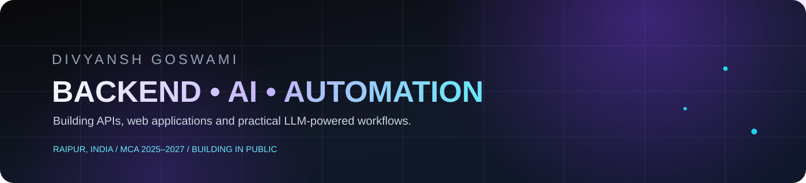
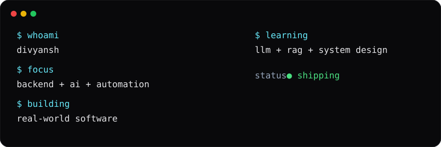

<div align="center">
  
</div>

<div align="center">

**MCA student in Raipur. I build backend APIs, web apps, and LLM-powered automation.**

[Portfolio](https://divyansh-portfolio-d9c7.onrender.com/) • [Portfolio v2](https://newport-rosy-nu.vercel.app/) • [Email](mailto:divyanshgoswami350@gmail.com)

</div>


## About

I'm a developer from Raipur. I finished my BCA in 2025 and I'm now doing my MCA at Shri Shankaracharya Professional University (2025–2027).

I've built 15+ websites, a REST API in Flask with MySQL, and an AI invoice-extraction tool that runs on n8n. I'm moving toward backend and AI engineering: APIs, databases, LLM applications, and RAG.

I learn by building things that work end to end, then improving them.

<div align="center">
  
</div>


## ⚡ Currently Building

| Status | Area | Where |
| --- | --- | --- |
| 🟢 Active | LLM-powered invoice extraction with n8n and Groq | [invoice](https://github.com/divyanshgoswami27/invoice) |
| 🟢 Active | Backend APIs with Flask, MySQL, and JWT | [user-api](https://github.com/divyanshgoswami27/user-api) |
| 🟡 Learning | ASP.NET Core APIs and Entity Framework Core | — |
| 🟡 Learning | RAG: embeddings, vector search, document Q&A | — |

## Tech Stack

No skill percentages. This is split by evidence: what my repos show, and what I'm still learning.

| | |
| --- | --- |
| **Used in my repos** | `Python` `Flask` `SQLAlchemy` `MySQL` `JWT auth` `TypeScript` `React` `Vite` `Tailwind CSS` `Framer Motion` `JavaScript` `HTML` `CSS` `n8n` `Groq API` `Vercel` |
| **Also working with or learning** | `ASP.NET Core` `Entity Framework Core` `C#` `Node.js` `Express` `Java` `C` `C++` `SQL Server` `Docker` `Postman` `WordPress` `Elementor` |
| **Tools** | `Git` `GitHub` |

## 🚀 Featured Projects

### InvoiceAI — invoice data extraction

A web interface that turns invoice PDFs and images into structured JSON: vendor, GST details, totals, and line items. Uploads go to an **n8n** workflow that uses **Groq**-hosted **Llama 3.3 70B** for extraction.

**Stack:** HTML, CSS, JavaScript • n8n • Groq API  
**Links:** [Repository](https://github.com/divyanshgoswami27/invoice) • [Interface preview](https://invoice-peach-eta.vercel.app/)

> The hosted page shows the interface. Uploads currently call an n8n instance running on my own machine.

### User Management API

A modular REST API for creating, listing, searching, and fetching users, with pagination and JWT-protected routes. Built as an assignment project.

**Stack:** Python • Flask • SQLAlchemy • MySQL  
**What's in it:** routes / services / models separation, input validation with clear 400 / 404 / 409 responses, SQL schema, and a written JWT auth guide.  
**Links:** [Repository](https://github.com/divyanshgoswami27/user-api)

### Portfolio v2

My newer portfolio site, built with React 19, TypeScript, Vite, Tailwind CSS 4, and Framer Motion, and deployed on Vercel.

**Links:** [Live site](https://newport-rosy-nu.vercel.app/) • [Repository](https://github.com/divyanshgoswami27/newport)

### NGO Website — Pranam Kiran Educational Samiti

A live website I built for a real organisation.

**Links:** [prnamkiran.org](https://prnamkiran.org/)

## 🤖 AI & LLM Lab

**InvoiceAI** is my first LLM application: it sends invoices through an n8n workflow to a Llama model on Groq and returns structured data. See [InvoiceAI](https://github.com/divyanshgoswami27/invoice).

**Coming soon:** a RAG project (embeddings, vector search, document Q&A) in Python. It will appear here once it exists.

## ⚙️ Backend Engineering

What I'm practising, with the repo that shows it:

- **REST API design:** resource endpoints, pagination, and search in [user-api](https://github.com/divyanshgoswami27/user-api)
- **Validation and error handling:** consistent JSON errors with proper status codes (400, 404, 409) in the same repo
- **Database design:** a relational schema with a unique constraint on email, MySQL via SQLAlchemy
- **Authentication:** token-based access with JWT, documented in `AUTH.md`
- **Layered structure:** routes, services, and models kept separate
- **Next:** automated tests, migrations, Docker, and ASP.NET Core with Entity Framework Core

## ⚡ Automation

InvoiceAI is built around a simple pipeline:

```text
Upload → Extract → Structure → Deliver
invoice    LLM       JSON        response to the page
file       on Groq
```

## Why I Build

I'd rather learn a technology by shipping something with it. Real problems show me what documentation doesn't. I like to get a first version working, then improve it, and I enjoy combining web development, backend engineering, AI, and automation in one project.

## Journey

| When | What |
| --- | --- |
| **2022** | Started my BCA |
| **2025** | Finished my BCA. Started my MCA. Focused on backend development |
| **2025–2026** | Web development, backend development, automation, and AI/ML exploration |
| **2026 onward** | LLMs, RAG, AI engineering, and building production-quality software |

## 🤝 Let's Connect

I'm open to internships, junior developer roles, freelance projects, and opportunities where I can grow as a backend and AI developer.

- Portfolio: [divyansh-portfolio-d9c7.onrender.com](https://divyansh-portfolio-d9c7.onrender.com/)
- Email: [divyanshgoswami350@gmail.com](mailto:divyanshgoswami350@gmail.com)

## 🚀 What I'm Building Next

These are directions, not finished projects:

- A **RAG** app for asking questions over documents
- An **ASP.NET Core** API with authentication and tests
- Deployed, reusable **n8n** workflows
- Small **developer tools** in Python


